# Data Connectors in Microsoft Sentinel

## Overview

A data connector in Microsoft Sentinel connects external data sources such as firewalls, servers, cloud services, and virtual machines to Sentinel so that security logs and events can be collected and analyzed.

Data connectors enable:

- Centralized log collection
- Consistent security-data ingestion
- Automated ingestion of security events
- Real-time monitoring across the environment

---

# Part 1: Integrate Threat Intelligence into Sentinel

Threat intelligence (TI) enhances detection by providing indicators of compromise (IoCs) from external sources. Microsoft Sentinel supports TAXII-based threat-intelligence ingestion for monitoring, alerting, and threat hunting.

## Step 1: Install the Threat Intelligence Solution

1. Open the Microsoft Sentinel workspace.
2. Select **Content hub** under **Content management**.
3. Search for **Threat Intelligence**.
4. Select **Threat Intelligence (NEW)**.
5. Click **Install**.

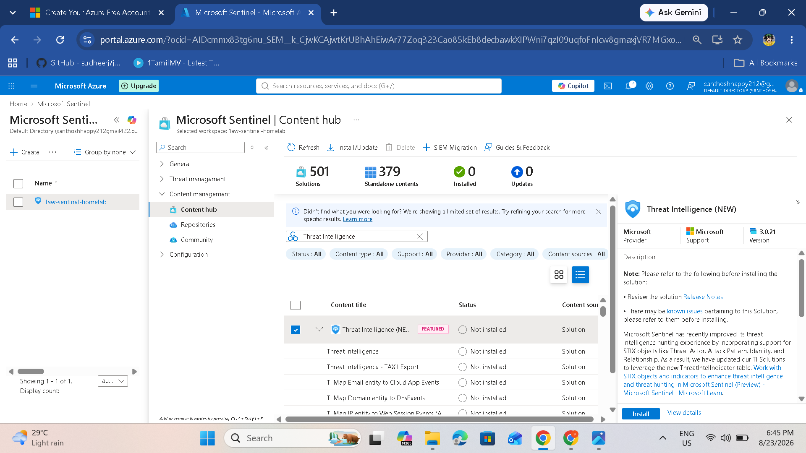

The source documentation also highlights support for STIX objects such as:

- Threat Actor
- Attack Pattern
- Identity
- Relationship

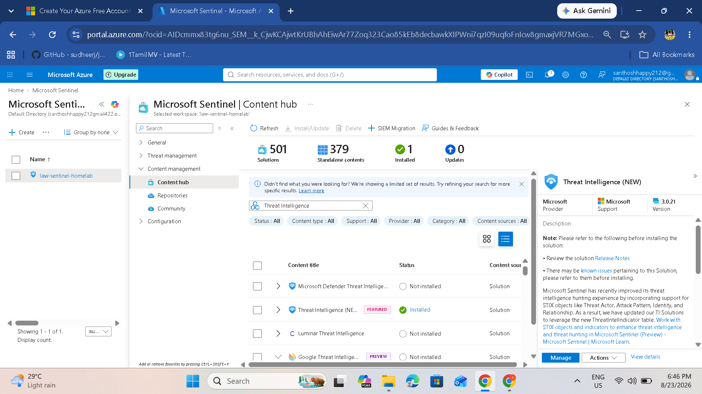

## Step 2: Access the TAXII Data Connector

TAXII (Trusted Automated eXchange of Intelligence Information) is used to exchange threat intelligence.

1. Go to **Data connectors** under **Configuration**.
2. Search for **TAXII**.
3. Select **Threat intelligence - TAXII**.
4. Click **Open connector page**.

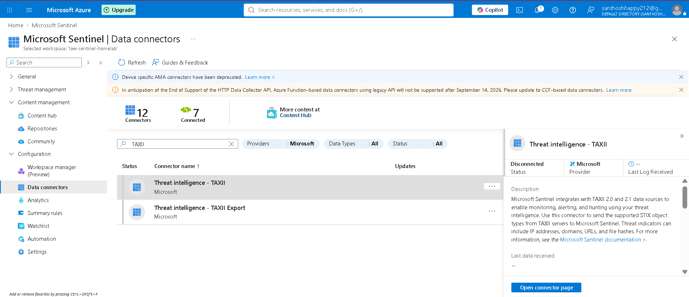

## Step 3: Configure the TAXII Server

The connector can be configured to stream STIX 2.0 or STIX 2.1 objects.

Enter:

- **Friendly name:** Example `MITRE_ATTACK_TAXII`
- **API root URL:** STIX/TAXII endpoint supplied by the threat-intelligence provider
- **Collection ID:** Provider-specific collection ID
- **Username:** `taxii12`
- **Password:** API key supplied by the provider

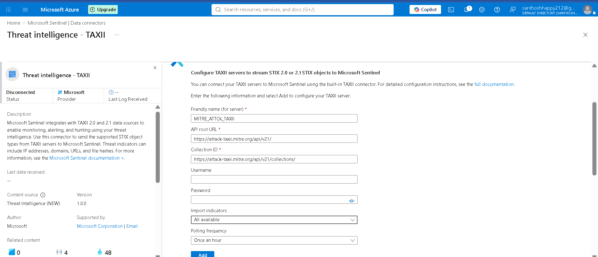


## Step 4: Configure Pulsedive Threat Intelligence

For this project, Pulsedive is used as a threat-intelligence source.

Enter:

- **Friendly name:** `Pulsedive-TAXII`
- **API Root URL:** Pulsedive TAXII endpoint
- **Collection ID:** Pulsedive collection ID
- **Username:** `taxii12`
- **Password:** Pulsedive API key

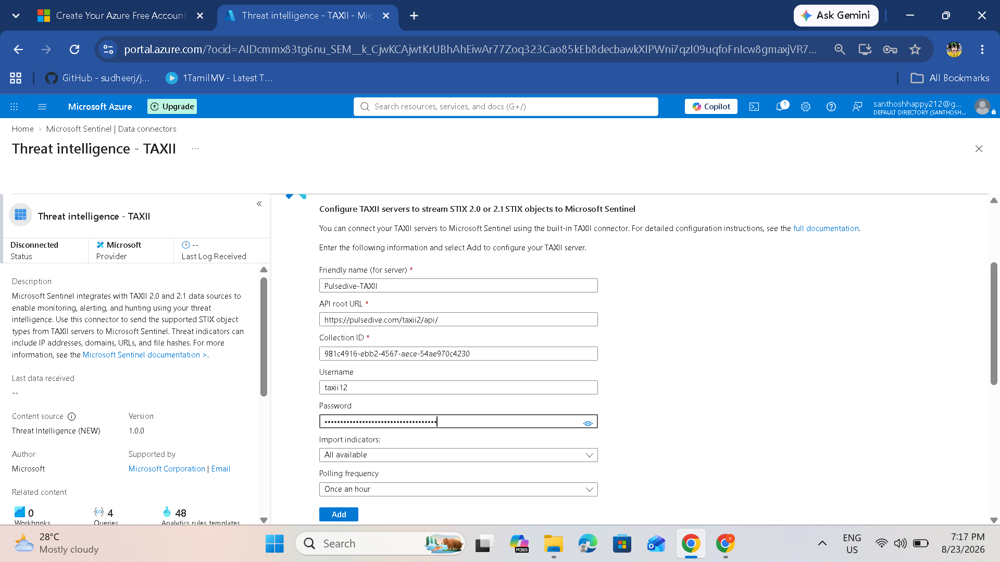

> **Security:** Never commit a real API key to GitHub. Keep secrets masked or stored in a secure secret-management system.

## Step 5: Verify the TAXII Connection

After adding the collection:

1. Check the configured TAXII server list.
2. Confirm the collection appears.
3. Confirm the status is **Connected**.
4. Check **Last data received** after the initial ingestion.

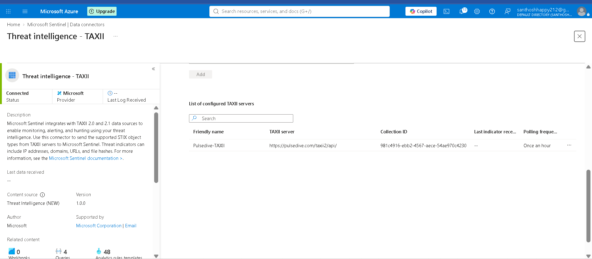

## Step 6: View Ingested Threat Intelligence

Go to **Threat intelligence** under **Threat management**.

The indicators received through the TAXII connector should be visible.

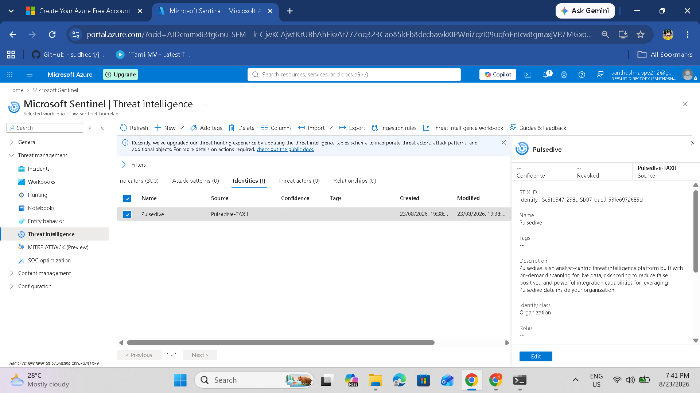

### Threat Intelligence Table Update

The source documentation identifies the newer threat-intelligence tables:

- `ThreatIntelIndicators`
- `ThreatIntelObjects`

The legacy `ThreatIntelligenceIndicator` table is deprecated in the documented workflow. Queries and workbooks that depend on the legacy schema should be reviewed and updated.

---

# Part 2: Integrating Windows Security Event Logs

Microsoft Sentinel can collect Windows security events through the **Azure Monitor Agent (AMA)**.

## Step 7: Install the Windows Security Events Solution

1. Return to **Content hub**.
2. Search for **Windows Security Events**.
3. Select the solution.
4. Click **Install**.

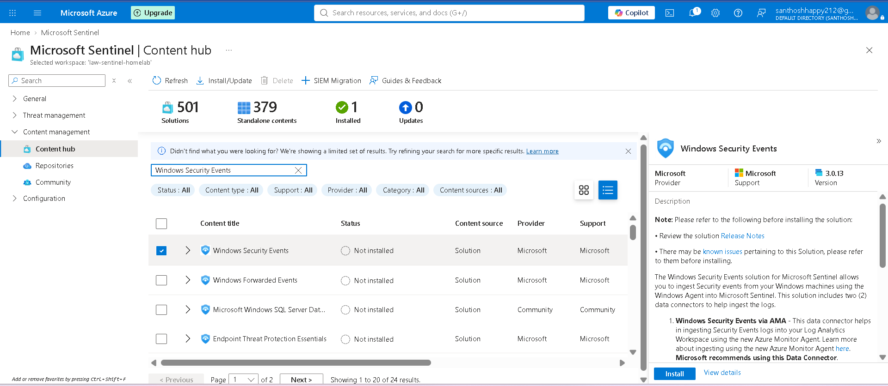

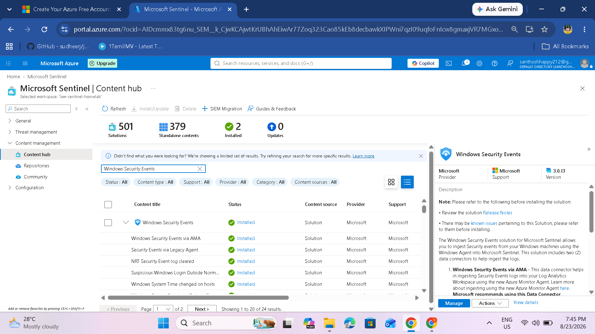

## Step 8: Open Windows Security Events via AMA

1. Go to **Data connectors**.
2. Find **Windows Security Events via AMA**.
3. Open the connector page.
4. Click **+ Create data collection rule**.

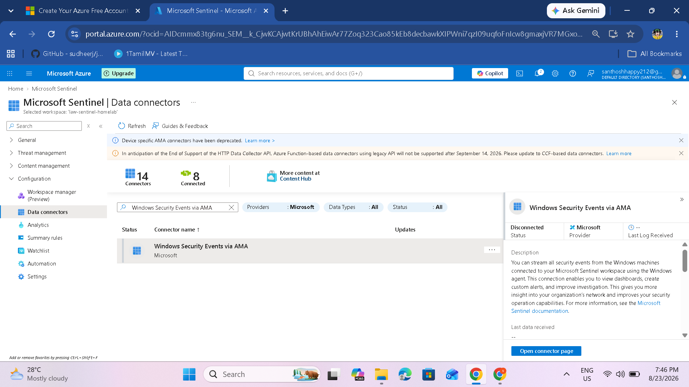

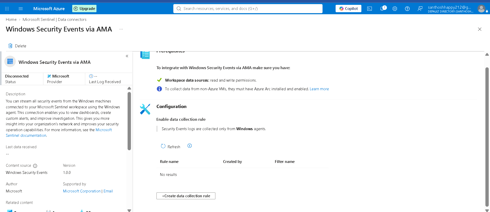

> **Important:** Use the Azure Monitor Agent (AMA) connector rather than the retired legacy Log Analytics agent.

## Step 9: Create the Data Collection Rule

Fill in the rule information:

- **Rule name:** `Windows-Security-Events-DCR`
- **Subscription:** Your Azure subscription
- **Resource group:** `rg-sentinel-homelab`
- **Region:** `East US`

Click **Next: Resources**.

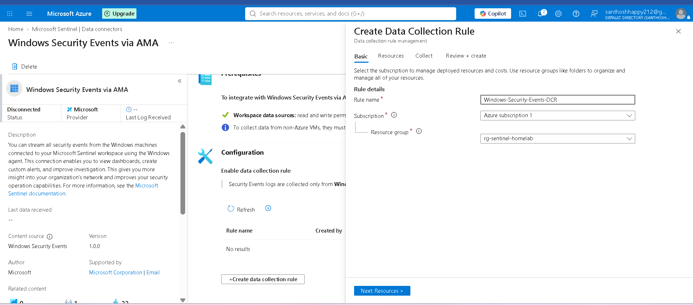

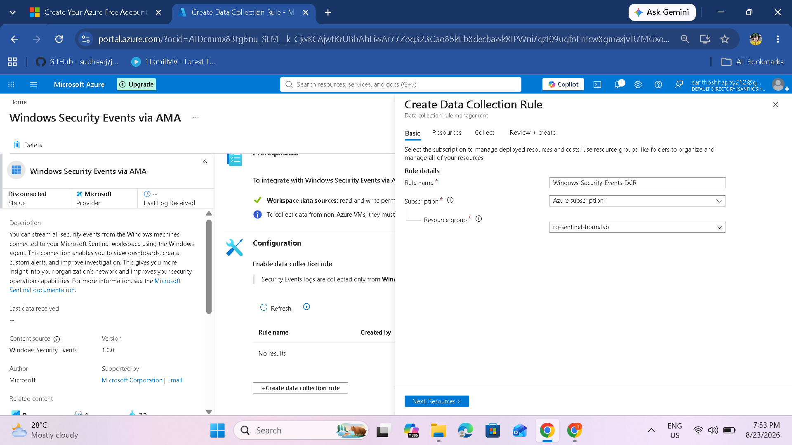

## Step 10: Select Resources

On the **Resources** tab:

1. Select the Windows VM(s) from which security events should be collected.
2. Continue to the next step.

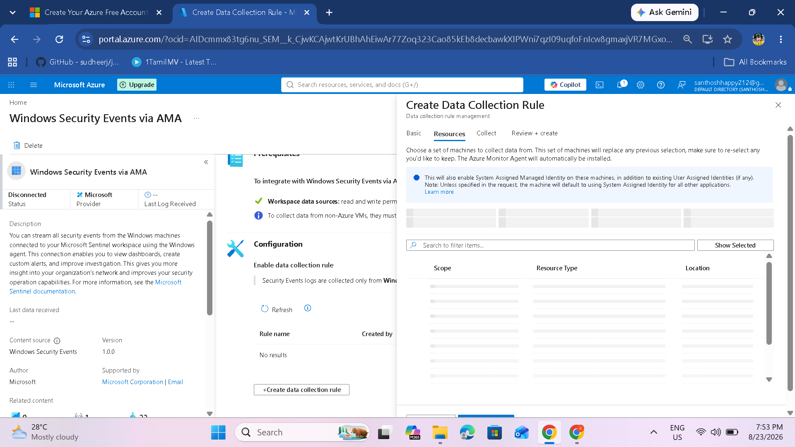

> For non-Azure VMs, the source documentation notes that Azure Arc must be installed and enabled.

## Step 11: Configure Event Collection

On the **Collect** tab, choose the events to stream:

- **All Security Events** — recommended for labs
- **Common** — standard event set
- **Minimal** — essential events
- **Custom** — selected event IDs

For this lab, select **All Security Events**.

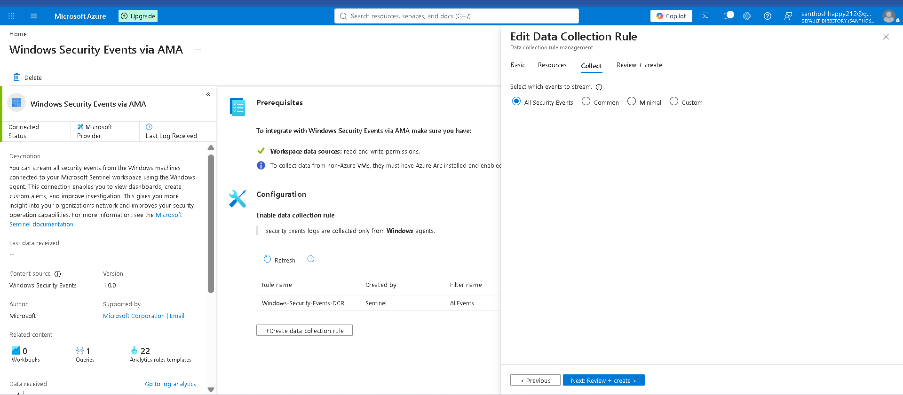

## Step 12: Review and Create

On **Review + create**:

1. Verify the rule settings.
2. Confirm validation passes.
3. Click **Create**.

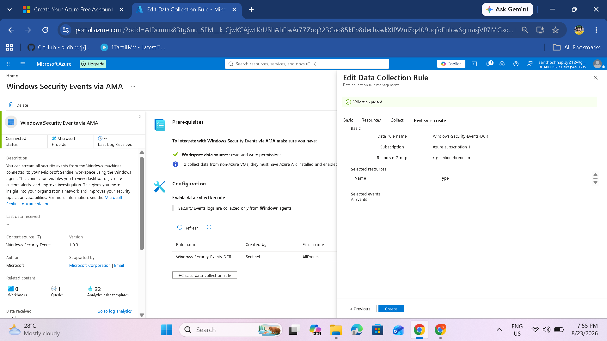

## Step 13: Verify the Windows Security Events Connector

After creation:

1. Return to the connector page.
2. Confirm the Data Collection Rule is listed.
3. Verify the connector status.
4. Check the data-received information.

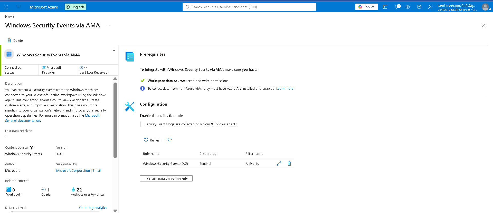

## Step 14: Verify Data Types

The connector should show:

- **Data type:** `SecurityEvents`
- Related content such as workbooks, queries, and analytics-rule templates.

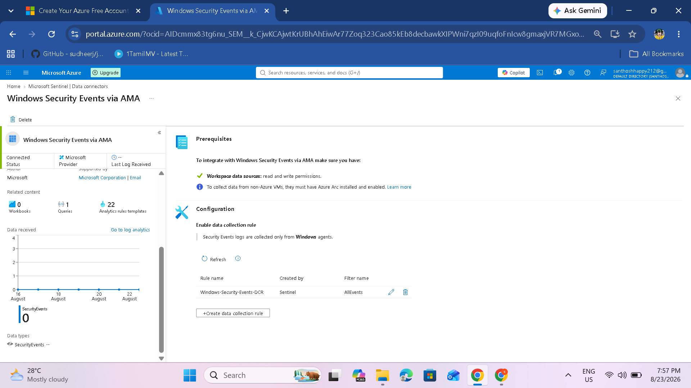

## Step 15: Verify Data in Log Analytics

Open **Logs** in Sentinel and run:

```kql
SecurityEvent
| take 10
```

You should see Windows Security Events being ingested into the workspace.

---

# Data Connector Summary

| Connector | Purpose | Agent / Method | Expected Status |
|---|---|---|---|
| Threat intelligence - TAXII | Ingest external threat intelligence | TAXII | Connected |
| Windows Security Events via AMA | Ingest Windows security logs | Azure Monitor Agent | Connected |

## Important Updates and Best Practices

### AMA vs Legacy Agent

The source documentation emphasizes using the current Azure Monitor Agent (AMA) rather than the legacy agent.

| Area | AMA | Legacy Agent |
|---|---|---|
| Current status | Supported | Deprecated/retired |
| TLS 1.2+ | Supported | Not supported in the documented transition |
| Defender portal compatibility | Compatible | Not compatible |
| Microsoft support | Supported | Ended |
| Data upload | Active | Ending/ended according to service transition |

### TLS Requirement

The source documentation states that Azure Monitor is enforcing TLS 1.2 and above from March 1, 2026. Systems using supported agents and compatible TLS versions should be used for continued ingestion.

## Troubleshooting

### TAXII Connector Not Connecting

Check:

- API Root URL
- API key
- Username `taxii12`
- Collection ID

### No Threat Intelligence Data

- Allow time for the first ingestion.
- Check the TAXII server status.
- Verify that the Collection ID is valid.
- Confirm the connector status.

### No Windows Security Events

Check:

- AMA is installed on the VM.
- The Data Collection Rule is applied.
- The VM is running and online.
- The correct event set is selected.

### AMA Not Supported on the VM

Upgrade the VM operating system where necessary or use an appropriate supported collection method.

## Next Steps

After configuring data connectors:

1. Integrating Microsoft Defender & Creating IoCs
2. Threat Detection (Analytics)
3. Playbooks and Logic Apps
4. Visualizing Data with Workbooks

## Summary

You have successfully:

- Installed the Threat Intelligence solution.
- Configured the TAXII connector.
- Configured Pulsedive threat intelligence.
- Verified the TAXII connector.
- Viewed ingested indicators.
- Installed the Windows Security Events solution.
- Created a Data Collection Rule.
- Selected Windows security events for collection.
- Verified the Windows Security Events connector.

Your Sentinel environment is now ready for threat detection, hunting, and automation.
