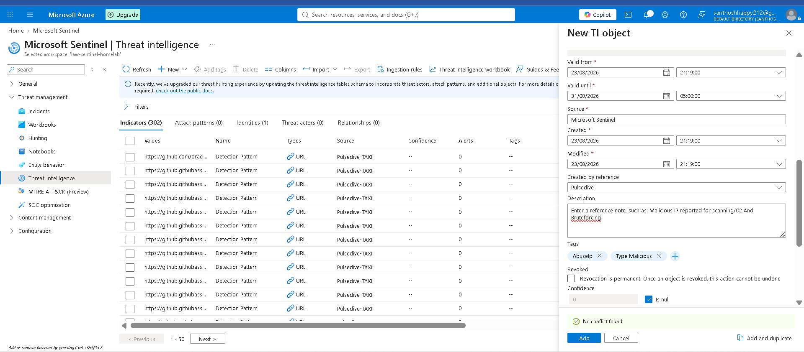
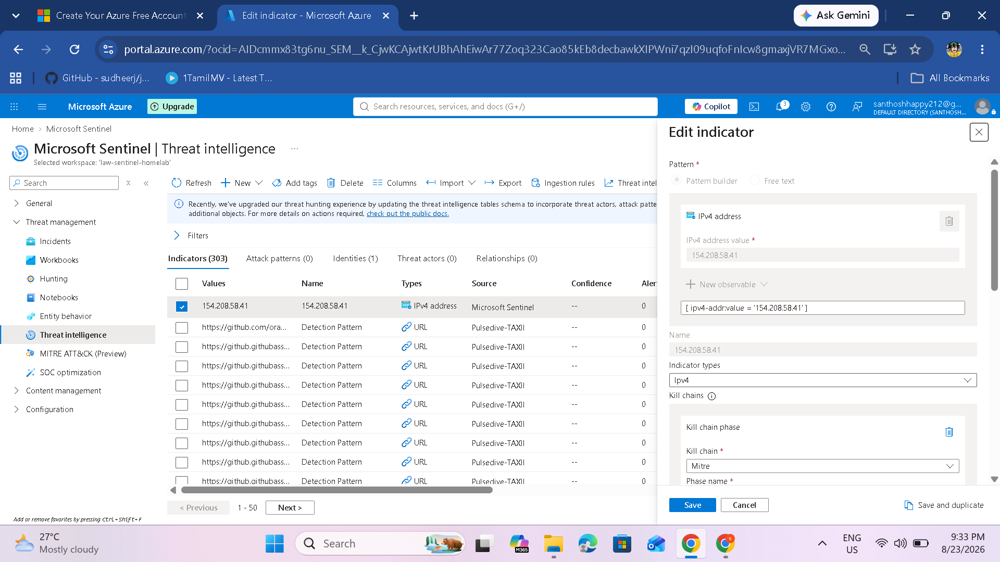
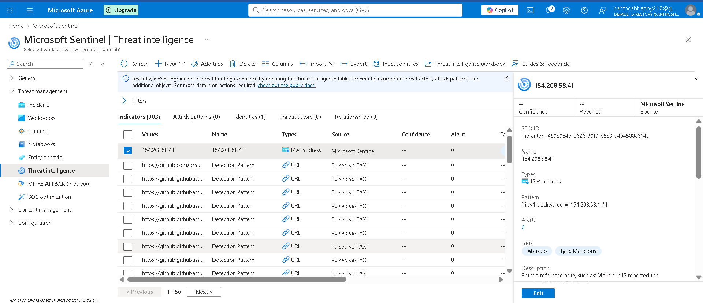

# Integrating Microsoft Defender & Creating Indicators of Compromise (IoCs)

## Overview

Feeding threat intelligence into Microsoft Sentinel improves detection, investigation, and response by providing information about emerging threats, malware, indicators of compromise (IoCs), and attacker activity.

It provides:

- **Enhanced Detection:** Threat intelligence can improve detection accuracy.
- **Contextual Awareness:** Sentinel can correlate alerts and events with threat intelligence.
- **Proactive Defense:** Known malicious indicators can be used for detection and response.
- **Unified Security Monitoring:** Threat intelligence can be analyzed together with other Sentinel data.

---

# Part 1: Onboard Microsoft Defender Threat Intelligence

## Step 1: Access the Defender Threat Intelligence Connector

In Microsoft Sentinel:

1. Go to **Data connectors** under **Configuration**.
2. Search for **Premium Microsoft Defender Threat Intelligence**.
3. Select the connector.
4. Click **Open connector page**.

## Step 2: Connect the Connector

1. Click **Connect**.
2. Sentinel can then ingest IOCs collected and curated with Defender.
3. Verify that the connector reports **Connected**.

> **Important:** The source documentation states that the Premium Microsoft Defender Threat Intelligence connector ingests data into the `ThreatIntelIndicators` table rather than the legacy `ThreatIntelligenceIndicator` table.

---

# Part 2: Understanding the Cyber Kill Chain

Understanding the cyber kill chain helps security analysts identify the stage of an attack and prioritize investigation and response.

## Kill Chain Phases

### 1. Reconnaissance

The attacker gathers information about the target.

Examples:

- Port scanning
- DNS enumeration
- Harvesting email addresses

### 2. Weaponization

The attacker combines an exploit with a malicious payload.

Examples:

- Exploit kits
- Malicious macros

### 3. Delivery

The malicious payload is delivered to the victim.

Examples:

- Phishing email
- Drive-by download
- USB media

### 4. Exploitation

A vulnerability is exploited to execute code.

Examples:

- Buffer overflow
- Zero-day exploitation

### 5. Installation

Malware is installed on the target asset.

Examples:

- Malware deployment
- Persistence mechanisms

### 6. Command & Control (C2)

The attacker establishes a communication channel for remote control.

Examples:

- C2 server communication
- Beaconing

### 7. Actions on Objectives

The attacker performs the final objectives after gaining access.

Examples:

- Data exfiltration
- Lateral movement
- Ransomware activity

---

# Part 3: Traffic Light Protocol (TLP)

TLP defines how threat information can be shared safely.

| TLP | Sharing Level | Meaning |
|---|---|---|
| **TLP:RED** | Specific recipients | Highly sensitive information; no further sharing |
| **TLP:AMBER** | Organization | Sensitive information that can be shared internally |
| **TLP:GREEN** | Community/peers | Can be shared with relevant peers but not publicly |
| **TLP:WHITE** | Public | Information that can be shared publicly |

Use the appropriate TLP marking when sharing indicators or threat intelligence.

---

# Part 4: Manually Create Indicators of Compromise

For this exercise, the source documentation uses a malicious IP address from AbuseIPDB as the example IOC.

## Step 1: Find a Malicious IP

1. Open AbuseIPDB.
2. Browse recent reports or search for a reported malicious IP.
3. Record the IP address and threat category.
4. Use only an indicator that is appropriate for a controlled lab exercise.

## Step 2: Access Threat Intelligence in Sentinel

1. In Microsoft Sentinel, go to **Threat intelligence** under **Threat management**.
2. Open the Threat Intelligence dashboard.

## Step 3: View Existing Indicators

The dashboard shown in the supplied screenshot contains threat-intelligence objects and indicators.

The source documentation describes the dashboard as showing:

- **Indicators:** Total threat indicators
- **Attack patterns:** MITRE ATT&CK attack patterns
- **Identities:** Threat actor identities
- **Threat actors:** Known threat actor groups
- **Relationships:** Connections between threat-intelligence objects

The indicator list can include fields such as:

- Name / value
- Type
- Source
- Confidence
- Alerts
- Tags

The supplied `screenshot-76.png` is the correct dashboard image for this stage.

## Step 4: Create a New IOC

Click **+ New** or **Add** to create an indicator.

For the example IOC, configure:

| Attribute | Example |
|---|---|
| Indicator Type | IPv4 |
| Value | `154.208.58.41` |
| Kill Chain Phase | Command & Control (C2) |
| Severity | Medium |
| TLP | TLP:AMBER |
| Tags | Malicious, C2, AbuseIPDB |
| Description | IP address reported for malicious activity on AbuseIPDB |

> The supplied `screenshot-79.png` shows the Microsoft Sentinel indicator editing/creation interface with the IPv4 value `154.208.58.41`.

## Step 5: Verify the IOC

After creating the IOC, return to the Threat Intelligence dashboard and verify that the new indicator appears in the list.

The supplied screenshot shows `154.208.58.41` listed as an IPv4 indicator with **Microsoft Sentinel** as the source.

---

# Part 5: IOC Attributes and Best Practices

## IOC Attributes

When creating an IOC, consider:

| Attribute | Example |
|---|---|
| Name | `Suspicious C2 IP from AbuseIPDB` |
| Type | IPv4, IPv6, Domain, URL, FileHash |
| Value | `154.208.58.41` |
| Description | IP reported for malicious scanning/C2 activity |
| Confidence | `85` |
| Severity | Low / Medium / High / Critical |
| Kill Chain | Command & Control |
| TLP | RED / AMBER / GREEN / WHITE |
| Tags | `C2`, `Malicious`, `AbuseIPDB` |
| Valid Until | `2026-12-31` |

## Best Practices

### Do

- Verify indicators using reliable sources.
- Document where and how an IOC was found.
- Set expiration dates for time-sensitive indicators.
- Review and update IOCs regularly.
- Prioritize high-severity and high-confidence indicators.
- Use TLP markings when sharing.
- Apply consistent tags.

### Do Not

- Add every suspicious IP without validation.
- Ignore the context surrounding an indicator.
- Forget the appropriate TLP classification.
- Create duplicate indicators without checking existing entries.

---

# Part 6: Using IOCs in Sentinel

## Where IOCs Are Stored

The source documentation identifies `ThreatIntelIndicators` as the current threat-intelligence table and `ThreatIntelligenceIndicator` as the legacy table.

## How IOCs Are Used

### Analytics Rules

IOC matches can be used to trigger detection alerts.

### Hunting Queries

Analysts can search historical logs for IOC matches.

### Workbooks

Threat-intelligence data can be visualized to identify trends.

### Incident Enrichment

IOC information can add context to security incidents.

---

# Important Threat Intelligence Updates

The source documentation highlights Microsoft's newer threat-intelligence schema and STIX object support.

Microsoft Sentinel can work with:

- STIX 2.0
- STIX 2.1
- Threat Actors
- Attack Patterns
- Identities
- Relationships

Queries and workbooks using the legacy threat-intelligence schema should be reviewed when moving to the newer tables.

---

# Summary

You have successfully:

- Understood the cyber kill chain.
- Learned the Traffic Light Protocol.
- Connected Microsoft Defender Threat Intelligence.
- Used a malicious IP as a manual IOC example.
- Created an IOC in Microsoft Sentinel.
- Verified the IOC in the Threat Intelligence dashboard.
- Reviewed IOC-management best practices.

## What You Can Do Next

- Create analytics rules that detect IOC matches.
- Build workbooks to visualize IOC activity.
- Automate responses to IOC matches.
- Share relevant indicators using appropriate TLP classifications.

## References

- Microsoft Sentinel Threat Intelligence
- Microsoft Defender Threat Intelligence
- STIX documentation
- Traffic Light Protocol (TLP)
- MITRE ATT&CK Framework
- AbuseIPDB

