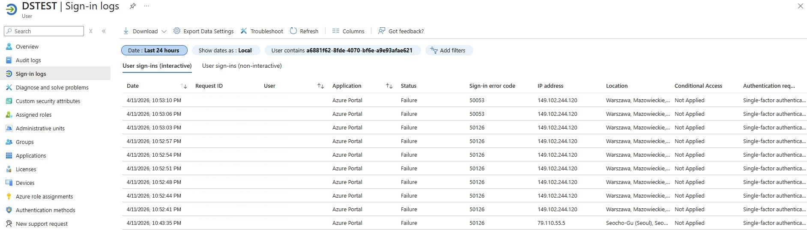
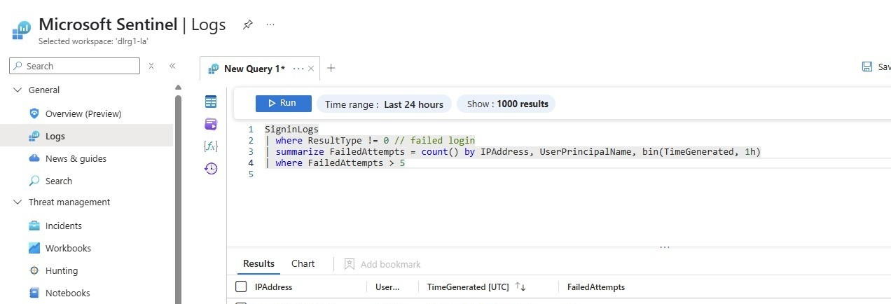
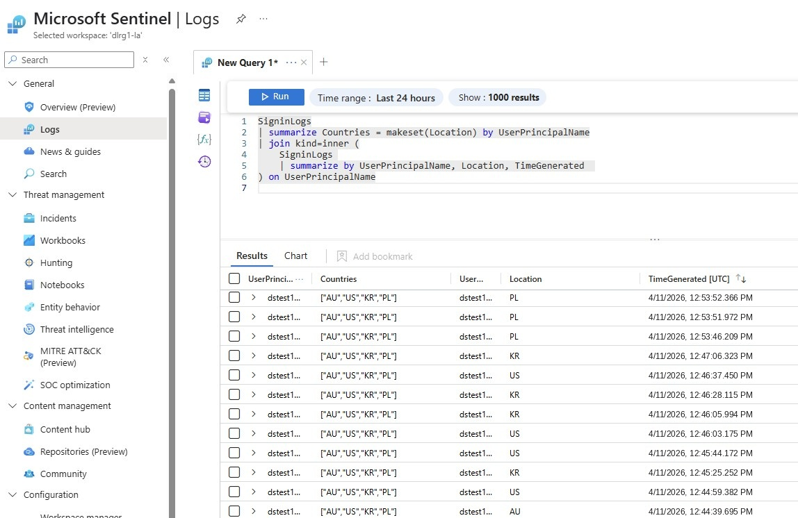
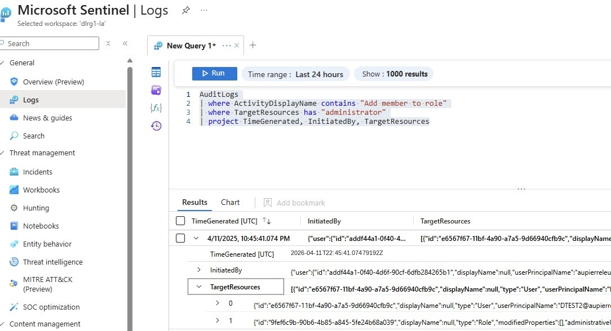
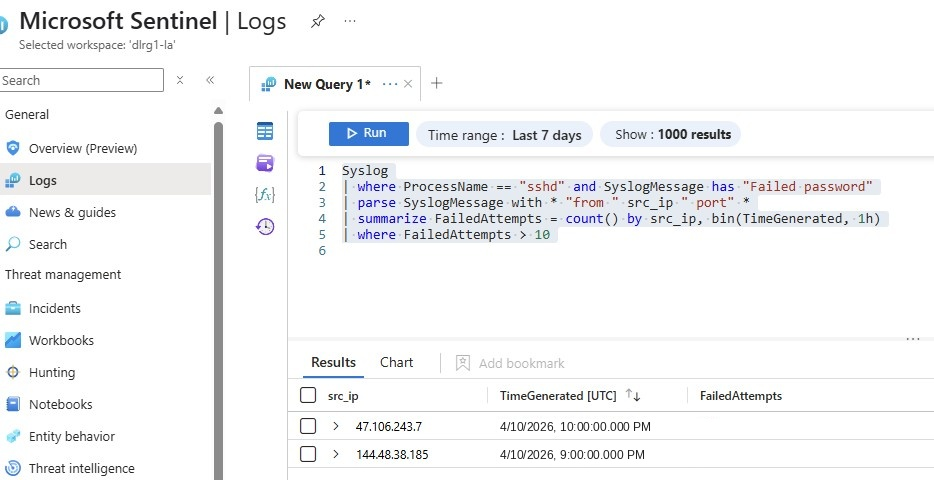
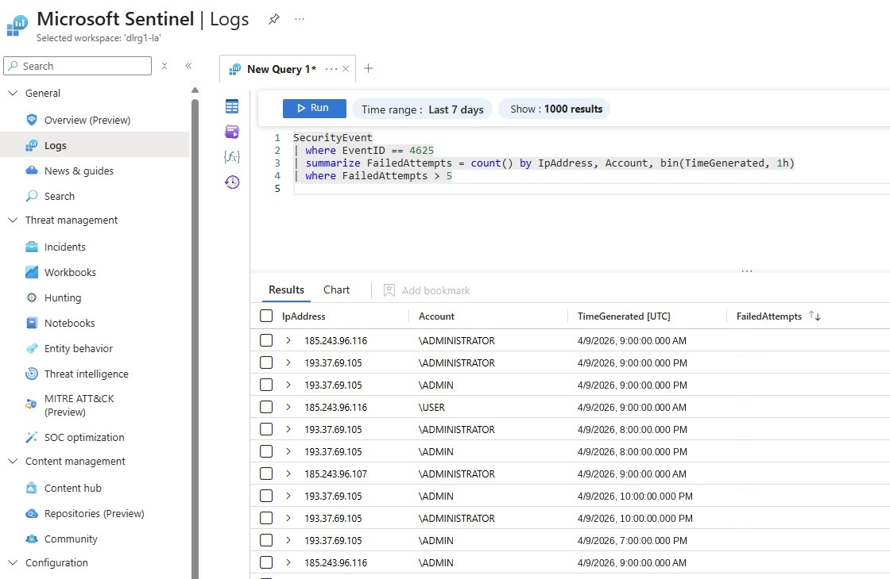

# Real-World KQL Queries for Microsoft Sentinel

Top 5 KQL use cases used in Microsoft Sentinel covering Azure cloud services and virtual machines (Windows & Linux). These queries support threat hunting, behavior analytics, brute-force detection, and cloud abuse detection.

## 1. Azure Sign-In Brute Force Detection

Detects multiple failed sign-ins from the same IP within a short time.

**How to simulate:** Create a new user ID and attempt multiple failed logins in the Azure portal.



**Verify the log**



**Sentinel > Logs**

```kql
SigninLogs
| where ResultType != 0 // failed login
| summarize FailedAttempts = count() by IPAddress, UserPrincipalName, bin(TimeGenerated, 1h)
| where FailedAttempts > 5
```

Catches brute-force attempts against Azure AD accounts.

## 2. Unusual User Sign-in Locations

Identifies sign-ins from geographic locations not seen before for a user.

**How to simulate:** Use a VPN to switch to a different location and log in with the same account in the Azure portal.

```kql
SigninLogs
| summarize Countries = makeset(Location) by UserPrincipalName
| join kind=inner (
    SigninLogs    
    | summarize by UserPrincipalName, Location, TimeGenerated
) on UserPrincipalName
```



Detects travel-based or impossible logins (e.g. “impossible travel” from two distant locations).

## 3. Elevation of Privileges in Azure AD

Detects when a user is added to a privileged group (e.g., Global Administrators).

**How to simulate:** Create a new user ID and add the Global Administrator role.

```kql
AuditLogs
| where OperationName == "Add member to role"
| where TargetResources has "Administrator"
| project TimeGenerated, InitiatedBy, TargetResources
```



Tracks critical changes to Azure AD privileges.

## 4. Linux SSH Brute Force (VM)

Brute force detection for Linux via SSH.

```kql
Syslog
| where ProcessName == "sshd" and SyslogMessage has "Failed password"
| parse SyslogMessage with * "from " src_ip " port" *
| summarize FailedAttempts = count() by src_ip, bin(TimeGenerated, 1h)
| where FailedAttempts > 10
```



## 5. Windows Brute Force (VM)

Windows brute force detection using failed logon events.

```kql
SecurityEvent
| where EventID == 4625
| summarize FailedAttempts = count() by IpAddress, Account, bin(TimeGenerated, 1h)
| where FailedAttempts > 5
```


