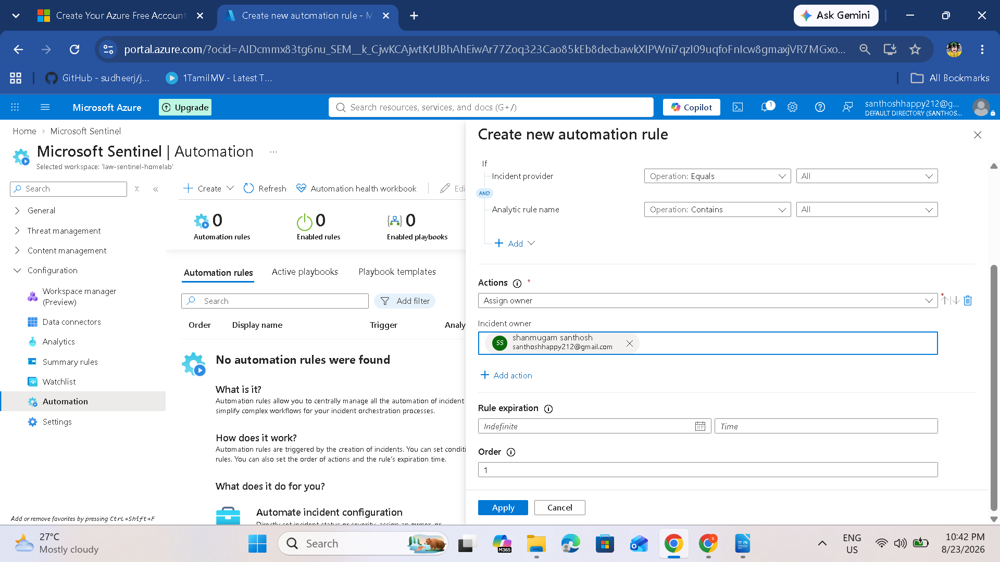
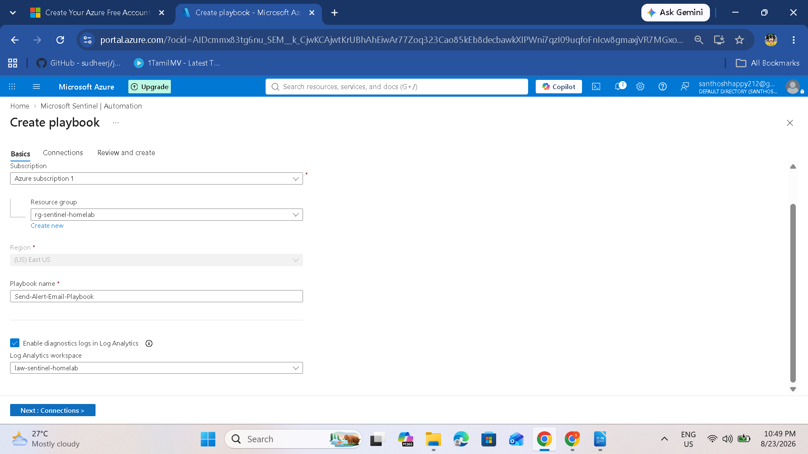
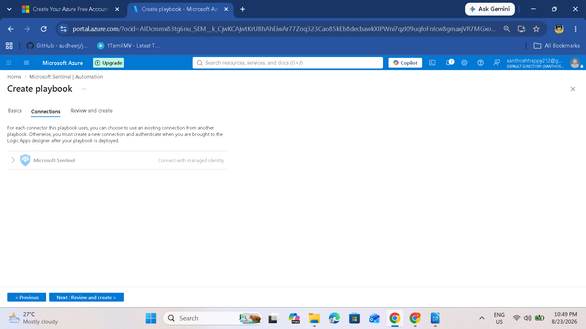
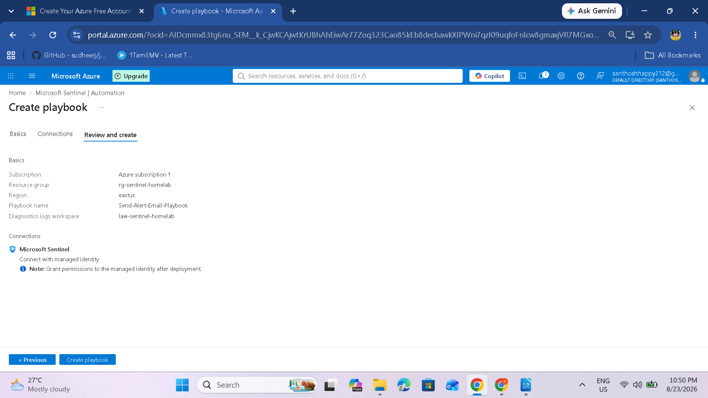
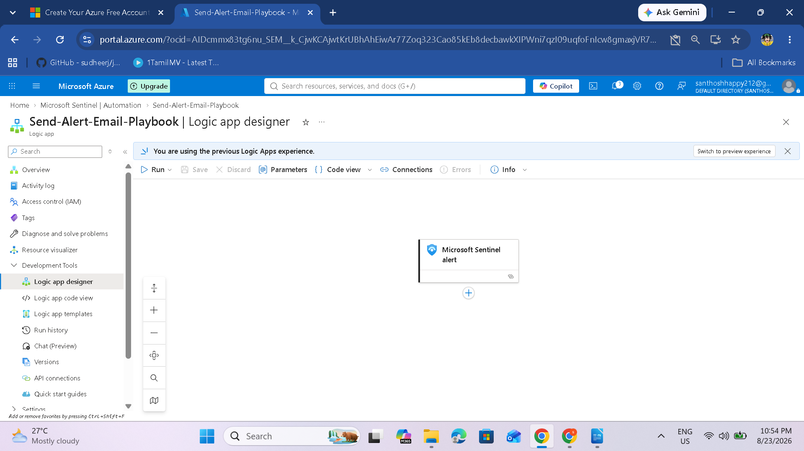
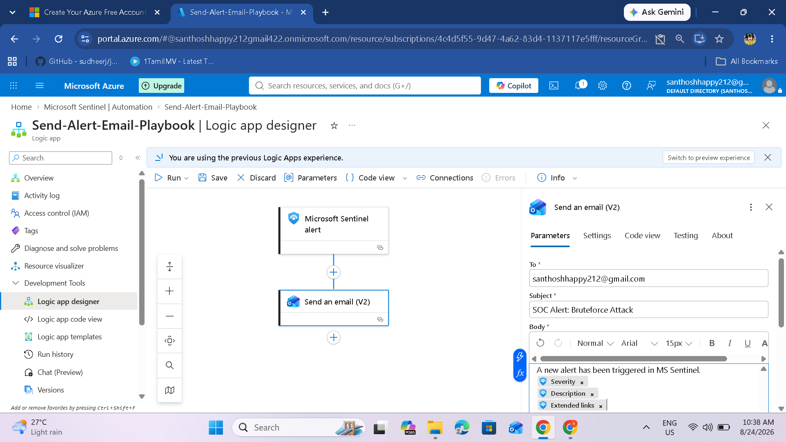
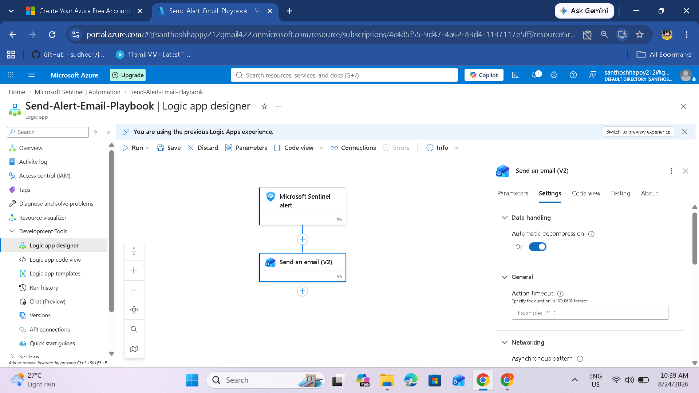
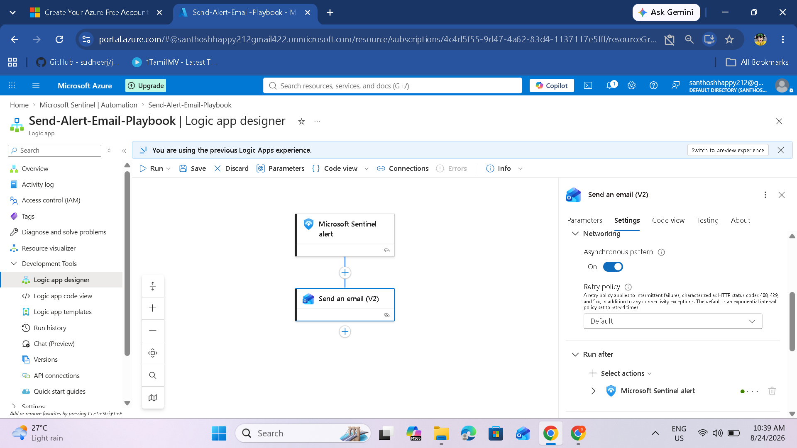
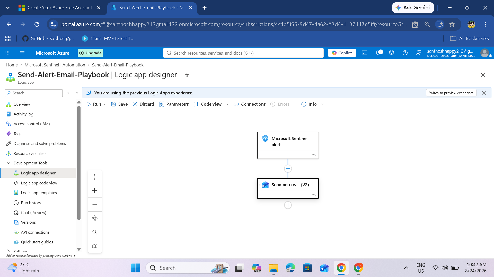

# Playbooks and Logic Apps in Microsoft Sentinel

## Overview

In Microsoft Sentinel, a **playbook** is an automated response plan for security incidents. It is built on top of **Azure Logic Apps** and defines what should happen when a specific alert or trigger occurs.

**Logic Apps** is the underlying Azure service used to create automated workflows. It provides a no-code/low-code workflow designer where connectors, steps, conditions, and actions can be combined.

Playbooks help SOC analysts convert manual, repetitive, and time-sensitive tasks into consistent automated workflows.

## Benefits

- Faster response time
- Consistent incident handling
- Reduced human error
- 24/7 automation
- Improved analyst efficiency

---

# Prerequisites

Before creating playbooks, ensure that you have:

- Microsoft Sentinel configured
- Appropriate permissions, including Contributor on the resource group where required
- An email service such as Office 365 or another supported connector
- Microsoft Sentinel Automation Contributor role assigned as required for playbook execution

---

# Part 1: Understanding Automation in Sentinel

## Automation Components

### Automation Rules

Automation rules define when automation should trigger.

Example:

> When an incident is created.

### Playbooks

Playbooks are the workflows that execute the automated actions. They are built using Azure Logic Apps.

### Triggers

Triggers start the playbook.

Examples:

- Incident creation
- Alert creation
- A specific Sentinel event

### Actions

Actions define what the playbook does.

Examples:

- Send an email
- Assign an incident
- Create a ticket
- Enrich an incident
- Block a malicious IP

---

# Common Automation Scenarios

- Incident assignment
- Email notifications
- IP blocking
- Ticket creation
- Data enrichment

---

# Part 2: Create an Automation Rule

Automation rules define when actions or playbooks should be triggered.

## Step 1: Access Automation

In Microsoft Sentinel:

1. Go to **Automation** under **Configuration**.
2. Click **+ Create**.
3. Select **Automation rule**.


### Screenshot Mapping

**Screenshot (95)** is the supplied Microsoft Sentinel **Create new automation rule** screen.

---

## Step 2: Configure the Automation Rule

Use the configuration from the source:

**Name**

`Brute Force Alert Automation`

**Trigger**

`When an incident is created`

**Condition**

Alert rule name contains:

`Brute Force`



### Screenshot Mapping

**Screenshot (96)** is the supplied automation-rule screen showing the condition/action configuration.

---

## Step 3: Add Actions

Configure the actions described in the source:

**Assign to**

`your.email@example.com`

**Change status**

`In progress`

**Add tasks**

`Investigation instructions`

> Replace this with your own SOC analyst email address when implementing the workflow.

---

## Step 4: Test the Automation Rule

Simulate a brute-force attack against the lab VM.

### Before the Brute-Force Attempt

- No incidents visible
- Automation rules not triggered

### After the Brute-Force Attempt

- Incident appears in the Incidents dashboard
- Automation rule triggers
- Incident is assigned automatically
- Status changes to `In progress`
- Investigation task is added

### Incident History From the Source

```text
Automation rule - Brute Force Alert Automation
Alert was assigned to your.email@example.com
Aug 13, 2025 10:34:45 AM

Automation rule - Brute Force Alert Automation
Status changed from 'New' to 'In progress'
Aug 13, 2025 10:34:40 AM

Automation Alert linked to incident #50383
Aug 13, 2025 10:32:18 AM
```

---

# Part 3: Create a Playbook in Microsoft Sentinel

This section builds a basic playbook that automatically sends an email notification.

## Step 1: Access Playbooks

In Microsoft Sentinel:

1. Go to **Automation**.
2. Click **Create**.
3. Select **Playbook**.

---

## Step 2: Configure Playbook Basics

Use:

| Setting | Value |
|---|---|
| Subscription | Your Azure subscription |
| Resource Group | `rg-sentinel-homelab` |
| Playbook Name | `Send-Alert-Email-Playbook` |
| Region | `East US` |



### Screenshot Mapping

**Screenshot (97)** is the supplied **Create playbook** basics screen.

---

## Step 3: Configure Connectors and Review





### Screenshot Mapping

- **Screenshot (98):** Playbook creation connector stage
- **Screenshot (99):** Playbook review/create stage

---

# Part 4: Add Managed Identity

A system-assigned managed identity is tied to the resource lifecycle and avoids storing credentials directly in code.

## Configuration

1. Open the playbook resource.
2. Go to the **Identity** tab.
3. Set **System assigned** to **On**.
4. Click **Save**.


---

# Part 5: Configure Role Assignment

First, add adding **Contributor** access for the managed identity:

1. Go to **Access control (IAM)**.
2. Click **+ Add**.
3. Select **Add role assignment**.
4. Select role: **Contributor**.
5. Assign access to: **Managed identity**.
6. Select your playbook.

The source later identifies **Microsoft Sentinel Automation Contributor** as the recommended role for Sentinel playbook execution.

---

# Part 6: Build the Playbook Logic

## Step 1: Open Logic App Designer

Go to your playbook resource and select:

**Logic app designer**

Then click:

**Add a trigger**

---

## Step 2: Add Microsoft Sentinel Trigger

Search for:

`Microsoft Sentinel`

Select:

**When a Microsoft Sentinel incident is created**

This trigger starts the playbook when a new incident appears.



### Screenshot Mapping

**Screenshot (100)** is the supplied Logic App Designer screen showing the Microsoft Sentinel trigger.

---

## Step 3: Add Email Action

Click:

**+ New step**

Search for:

- `Office 365 Outlook`
- or `Email`

Select:

**Send an email (V2)**



### Screenshot Mapping

**Screenshot (101)** is the supplied Logic App Designer screen showing the email action added to the workflow.

---

## Step 4: Configure Email Settings

Use:

**To**

`your.email@example.com` *(replace with your own email)*

**Subject**

`SOC Alert`

**Body**

`A new alert has been triggered in MS Sentinel.`



### Screenshot Mapping

**Screenshot (102)** is the supplied screenshot showing the email action configuration.

---

## Step 5: Add Dynamic Content

The following incident information is useful as dynamic content:

- Incident Name
- Severity
- Description
- Alert details

The supplied Logic App screenshots continue to show the email-action configuration and workflow.



### Screenshot Mapping

**Screenshot (103)** is mapped to the supplied email-action configuration stage.

---

## Step 6: Save the Playbook

Click **Save** to save the Logic App design.



### Screenshot Mapping

**Screenshot (104)** is the supplied final Logic App Designer view showing the Sentinel incident trigger connected to the email action.

---

# Part 7: Playbook Permissions

## Important Permission Issue

Testing can fail when Microsoft Sentinel does not have the required access to the resource group containing the playbook.

## Recommended Solution

Grant Sentinel permission on the resource group:

1. Open the resource group:

   `rg-sentinel-homelab`

2. Select **Access control (IAM)**.
3. Click **+ Add**.
4. Select **Add role assignment**.
5. Select:

   **Microsoft Sentinel Automation Contributor**

6. Assign access to the appropriate managed identity.
7. Select the playbook.
8. Click **Review + assign**.

> **Important:** **Microsoft Sentinel Automation Contributor** is the recommended role for playbook execution.

---

# Part 8: Test the Playbook

## Step 1: Run the Playbook Manually

1. Go to **Incidents** in Sentinel.
2. Select a previously generated incident.
3. Click **Run playbook**.
4. Select your playbook.
5. Click **Run**.

## Step 2: Verify Execution

Check:

- Your email for the notification
- Playbook run history in Logic Apps
- Workflow execution status
- Any error messages

## Step 3: Automate with Automation Rules

After confirming that the playbook works:

1. Go to **Automation**.
2. Create or edit an automation rule.
3. Under **Actions**, select **Run playbook**.
4. Select `Send-Alert-Email-Playbook`.

The playbook can then execute automatically when the defined incident condition occurs.

---

# Troubleshooting

## Error: Playbook Not Running

### Solution

Grant the required Sentinel permissions:

**Role:**

`Microsoft Sentinel Automation Contributor`

Apply it to the resource group containing the playbooks.

## Error: Email Not Sending

Check:

- Email connection authentication
- Recipient email address
- Office 365 Outlook connector
- Logic App run history

## Error: Playbook Not Found

Check:

- Subscription
- Resource group
- Playbook name
- Playbook enabled status

---

# Important Updates in 2026

## Playbook Permissions

Key points include:

**Microsoft Sentinel Automation Contributor**

as the recommended role for playbook execution.

## Managed Identity

The source recommends a **system-assigned managed identity** because:

- Credentials do not need to be stored in code.
- The identity follows the resource lifecycle.
- Authentication can be managed through Azure permissions.

## Email Connectors

The source identifies these connectors:

- Office 365 Outlook — Current
- Outlook.com — Current
- Gmail — Current
- SendGrid — Current

---

# Playbook Best Practices

## Do

- Test thoroughly in a non-production environment.
- Use managed identities.
- Add error handling.
- Log activities for auditing.
- Keep playbooks simple.
- Document playbooks for other analysts.

## Don't

- Hardcode credentials.
- Create infinite loops.
- Ignore permission requirements.
- Skip testing before production deployment.

---

# Summary

You have successfully:

- Created an Automation Rule for brute-force alerts.
- Built a playbook using Logic Apps.
- Configured email notifications.
- Set up Sentinel Automation Contributor permissions.
- Tested the playbook manually.
- Reviewed playbook automation best practices.

## Automation Components

| Component | Name | Function |
|---|---|---|
| Automation Rule | `Brute Force Alert Automation` | Assigns incidents and updates status |
| Playbook | `Send-Alert-Email-Playbook` | Sends email notifications |

## Next Step

After creating playbooks:

**Visualize Security Data in Microsoft Sentinel**

## References

- Microsoft Sentinel Playbooks
- Azure Logic Apps
- Microsoft Sentinel Automation
- Office 365 Outlook Connector

## Complete Screenshot Map

| Screenshot | Correct Mapping |
|---|---|
| `Screenshot (94).png` | Analytics dashboard — All rules; this is an analytics image despite being stored in the Playbooks folder in the supplied ZIP |
| `Screenshot (95).png` | Automation rule — Create new automation rule |
| `Screenshot (96).png` | Automation rule — Conditions/actions |
| `Screenshot (97).png` | Playbook — Basics |
| `Screenshot (98).png` | Playbook — Connector/configuration stage |
| `Screenshot (99).png` | Playbook — Review/create |
| `Screenshot (100).png` | Logic App Designer — Microsoft Sentinel trigger |
| `Screenshot (101).png` | Logic App Designer — Email action |
| `Screenshot (102).png` | Email action — Configuration |
| `Screenshot (103).png` | Email action — Additional configuration/dynamic content |
| `Screenshot (104).png` | Final Logic App Designer workflow |

