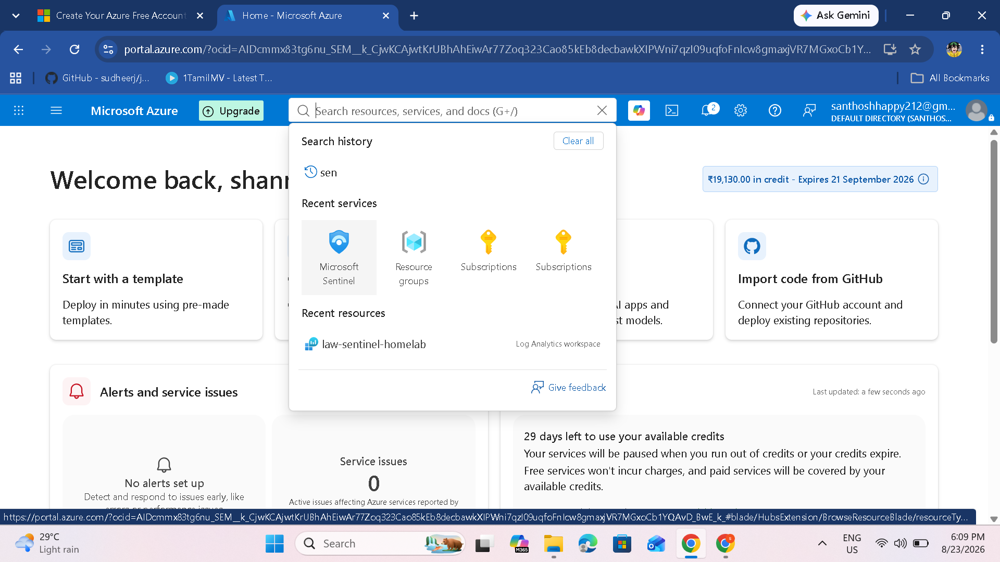
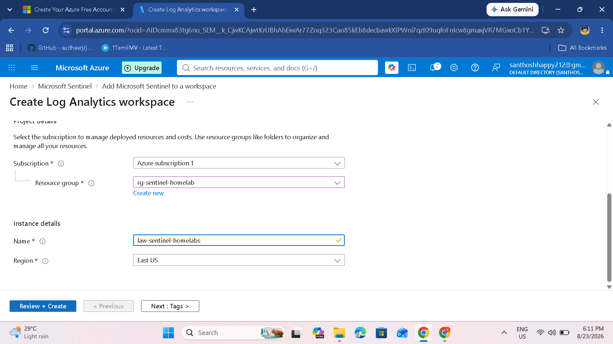
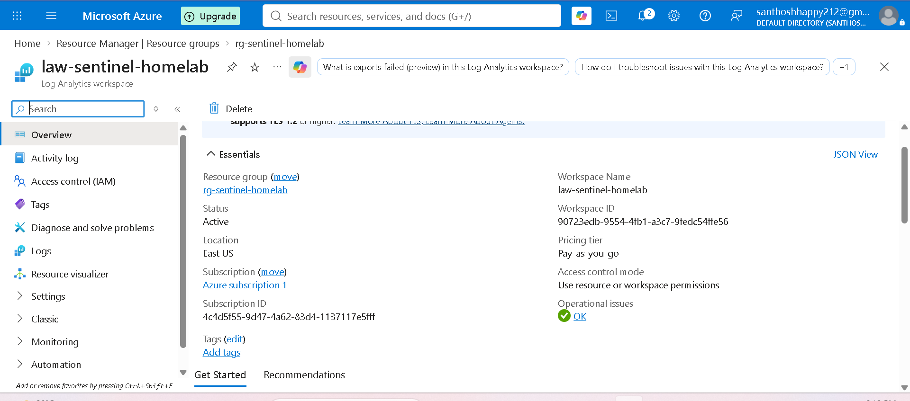
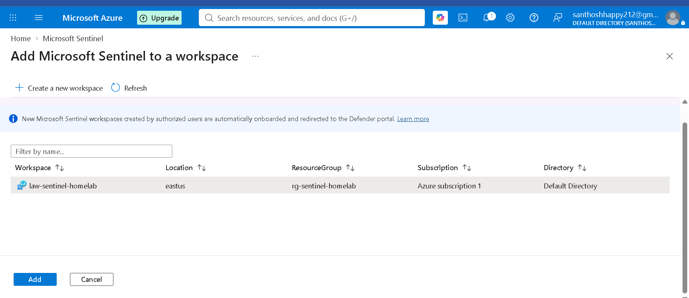
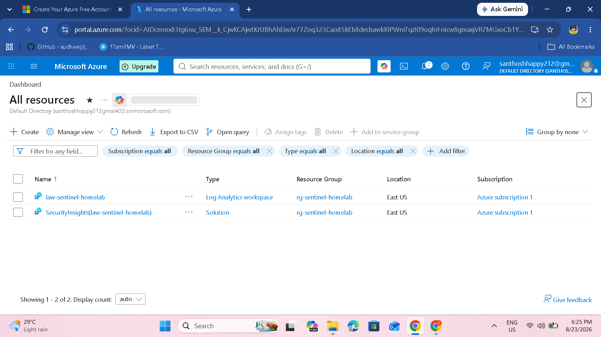

# Microsoft Sentinel Set Up

## Overview

Microsoft Sentinel is a cloud-native SIEM (Security Information and Event Management) and SOAR (Security Orchestration, Automation, and Response) solution built on Azure. It enables organizations to collect security data at cloud scale from multiple sources, including users, applications, servers, and devices.

Sentinel uses advanced analytics, threat intelligence, and AI-driven detection to identify potential threats in real time. It also provides built-in automation and orchestration tools to streamline incident investigation and response, helping security teams quickly prioritize and mitigate risks.

Because it is cloud-based, Sentinel offers scalability, integration with many Microsoft and third-party services, and reduces the overhead of managing traditional on-premises SIEM infrastructure.

## Prerequisites

Before starting, ensure you have:

- An active Azure subscription (free trial or paid)
- Contributor or Owner permissions on the subscription
- Access to the Azure portal: https://portal.azure.com

## Step 1: Create a Resource Group

A resource group is a logical container that holds related Azure resources. It is used here to organize all Sentinel-related resources.

### Instructions

1. Navigate to the Azure portal and log in.
2. In the search bar, type **Resource groups** and select it.
3. Click **+ Create** or **Create**.
4. Fill in:
   - **Subscription:** Select your Azure subscription.
   - **Resource group name:** `rg-sentinel-homelab`
   - **Region:** Select your preferred region, for example `East US`.
5. Click **Review + create**, then **Create**.

### Verification

Once created, the resource group will appear in the resource-group list. You can also verify it from **All resources**.

## Step 2: Create a Log Analytics Workspace

Microsoft Sentinel requires a Log Analytics workspace to store security logs and events.

### Instructions

1. In the Azure portal search bar, type **Log Analytics workspaces**.
2. Click **+ Create**.
3. Fill in:
   - **Subscription:** Select your Azure subscription.
   - **Resource group:** `rg-sentinel-homelab`
   - **Name:** `law-sentinel-homelabs`
   - **Region:** Select the same region as the resource group.
4. Click **Review + create**, then **Create**.

> **Pro Tip:** Log Analytics workspace names must be globally unique. The example uses `law-sentinel-homelabs` with an additional `s` to avoid a name conflict.

## Step 3: Verify the Log Analytics Workspace

After creation:

1. Go to **All resources**.
2. Open `law-sentinel-homelabs`.
3. Verify:
   - **Status:** Active
   - **Pricing tier:** Pay-as-you-go or your selected tier
   - **Location:** Matches your resource group

The workspace overview should show:

- **Workspace Name:** `law-sentinel-homelabs`
- **Workspace ID:** Unique workspace identifier
- **Resource Group:** `rg-sentinel-homelab`
- **Status:** Active
- **Location:** East US
- **Pricing Tier:** Pay-as-you-go

## Step 4: Enable Microsoft Sentinel

1. In the Azure portal search bar, type **Microsoft Sentinel**.
2. Select the service.
3. Click **+ Create** or **Create Microsoft Sentinel**.
4. Select `law-sentinel-homelabs`.
5. Click **Add**.

> **Important:** New Microsoft Sentinel workspaces are automatically onboarded and redirected to the Microsoft Defender portal. Sentinel can still be accessed from the Azure portal through the Microsoft Sentinel service.

## Step 5: Verify the Sentinel Setup

Go to **All resources** and confirm that the following resources exist:

- `law-sentinel-homelabs` — Log Analytics workspace
- `SecurityInsights(law-sentinel-homelabs)` — Microsoft Sentinel solution

### What to Look For

- The Log Analytics workspace is present and **Active**.
- The `SecurityInsights` solution is present.
- Both resources belong to `rg-sentinel-homelab`.
- The location is consistent.

## Step 6: Access the Microsoft Sentinel Dashboard

1. Search for **Microsoft Sentinel** in the Azure portal.
2. Select the service.
3. Select your workspace.
4. Open the Sentinel dashboard.

The dashboard provides access to:

- **Overview:** Security alerts and incident summary
- **Incidents:** Detected threats and severity
- **Workbooks:** Security visualization dashboards
- **Hunting:** Proactive threat hunting
- **Analytics:** Detection rules and scheduled queries
- **Data Connectors:** Data-source integrations

## Important Updates in 2026

### TLS 1.2+ Requirement

The source documentation notes that Azure Monitor is enforcing TLS 1.2 and above beginning March 1, 2026. The Azure Monitor Agent (AMA) supports this requirement.

### Microsoft Sentinel in the Defender Portal

The source documentation also notes the transition of Microsoft Sentinel toward the Microsoft Defender portal:

- New workspaces are redirected to the Defender portal.
- Existing workspaces can continue to be accessed from Azure according to Microsoft's transition timeline.
- The goal is a unified security operations experience.

## Troubleshooting

### Workspace Name Conflict

**Error:** Workspace name is already taken.

**Solution:** Add a unique suffix, such as:

- `law-sentinel-homelabs`
- `law-sentinel-homelab-dev`
- `law-sentinel-homelab-01`

### Sentinel Not Appearing

Refresh the portal or check **All resources**. The Sentinel solution appears as:

`SecurityInsights(<workspace-name>)`

### Permission Issues

Ensure the account has **Contributor** or **Owner** permissions required for the resources being created.

### Workspace Not Active

If the workspace shows **Provisioning** or **Failed**, wait a few minutes and refresh. If provisioning fails, recreate the workspace using a unique name in the same region.

## Next Steps

After completing the setup, continue with:

1. Data Connectors in Microsoft Sentinel
2. Integrating Microsoft Defender & Creating IoCs
3. Threat Detection (Analytics)
4. Playbooks and Logic Apps
5. Visualizing Data with Workbooks

## Summary

You have successfully:

- Created the resource group `rg-sentinel-homelab`.
- Created the Log Analytics workspace `law-sentinel-homelabs`.
- Enabled Microsoft Sentinel.
- Verified the Sentinel solution and workspace.

### Resource Summary

| Resource | Value |
|---|---|
| Resource Group | `rg-sentinel-homelab` |
| Log Analytics Workspace | `law-sentinel-homelabs` |
| Sentinel Solution | `SecurityInsights(law-sentinel-homelabs)` |
| Region | East US |
| Subscription | Azure Subscription 1 |

## Screenshot Map

| Step | Screenshot | Purpose |
|---|---|---|
| 1 | `screenshot-48.png` | Azure portal home / Microsoft Sentinel access |
| 2 | `screenshot-49.png` | Log Analytics workspace creation |
| 3 | `screenshot-51.png` | Workspace overview and status |
| 4 | `screenshot-53.png` | Add Microsoft Sentinel to workspace |
| 5 | `screenshot-55.png` | Verify Sentinel resources |

> **Naming note:** The example workspace uses `law-sentinel-homelabs` because the original `law-sentinel-homelab` name was already taken. In another Azure subscription, use a globally unique workspace name.
