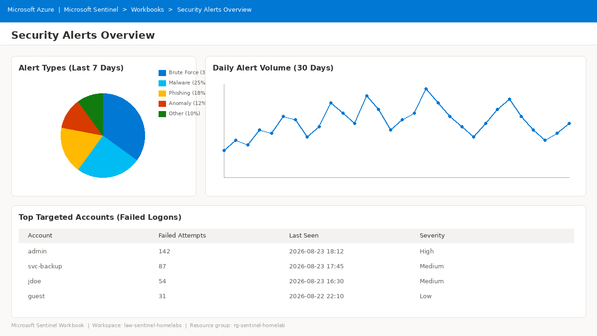

# Visualize Security Data in MS Sentinel

## Overview

Visualizing data in a SIEM transforms raw security logs and events into clear, actionable insights.

Large volumes of security data can be difficult to understand through raw logs alone. Charts, graphs, tables, and dashboards help SOC analysts:

- Identify patterns
- Detect trends
- Find anomalies
- Prioritize threats
- Monitor security posture
- Support incident decisions
- Report security information to stakeholders

---

# Understanding Workbooks

**Workbooks** are interactive dashboards used to visualize, analyze, and explore security data from multiple sources.

They combine:

- Charts
- Tables
- Graphs
- Text
- Filters
- Query results

## Key Features

### Interactive Dashboards

Analysts can click and filter data.

### Customizable

Workbooks can be built from scratch or from templates.

### Multiple Visualizations

Supported visualization concepts include:

- Charts
- Tables
- Graphs
- Maps

### Real-Time Data

Workbooks support auto-refresh.

### Collaboration

Workbooks can be shared with team members.

---

# Prerequisites

Before creating workbooks, ensure you have:

- Microsoft Sentinel configured and running
- Workbook Reader or Workbook Contributor permissions on the resource group
- Data connectors configured and ingesting data
- Sentinel data lake selected as the data source for optimal performance

---

# Part 1: Create a Workbook for Security Alerts

## Step 1: Access Workbooks

In Microsoft Sentinel:

1. Go to **Workbooks** under **Threat management**.
2. Click **Add workbook**.
3. Create a new workbook from scratch.

## Step 2: Enter Edit Mode

Click:

**Edit**

at the top of the workbook.

This allows you to add queries and visualizations.

## Step 3: Add a Query

Click:

**Add → Add data source and visualization**

Configure:

**Data Source**

`Sentinel data lake`

**Resource Type**

`Log Analytics`

Then choose your workspace.

---

# Part 2: Alert Summary Query

Use the following KQL query to summarize alerts by name over the past 30 days:

```kql
SecurityAlert
| where TimeGenerated > ago(30d)
| summarize AlertCount = count() by AlertName
| order by AlertCount desc
```

## Query Explanation

The query:

1. Filters alerts generated in the last 30 days.
2. Groups alerts by alert name.
3. Counts each alert type.
4. Orders the results from most frequent to least frequent.

## Configure Visualization

Under **Visualization**, select:

**Pie chart**

This displays the distribution of alert types.

## Save the Workbook

1. Click **Done editing**.
2. Click **Save**.
3. Enter:

   `sentinel-project-workspace`

4. Select your subscription and resource group.

---

# Part 3: Create a Time-Based Alert Workbook

## Step 1: Add Another Query

In the same workbook:

**Add → Add data source and visualization**

Select:

`Sentinel data lake`

## Step 2: Create the Daily Alert Query

```kql
SecurityAlert
| where TimeGenerated > ago(30d)
| summarize AlertCount = count() by bin(TimeGenerated, 1d)
| order by TimeGenerated asc
```

## Query Explanation

The query:

- Filters alerts from the last 30 days.
- Groups alerts by day.
- Counts alerts per day.
- Orders the results chronologically.

## Step 3: Configure Visualization

Select either:

- **Line chart**
- **Bar chart**

The result shows alert volume over time.

## Step 4: Expected Workbook

Key capabilities include:

- **Pie chart:** Distribution of alert types
- **Line chart:** Alert volume over 30 days



> **Tip:** Capture your own workbook screenshot after you build it and replace the example image above. The visualization should clearly show an alert-type distribution (pie) and a time-series of daily alert volume (line).


---

# Part 4: Visualize Brute Force Attempts

## Step 1: Add the Brute Force Query

```kql
SecurityEvent
| where EventID == 4625
| where TimeGenerated > ago(24h)
| summarize FailedAttempts = count() by Account, bin(TimeGenerated, 1h)
| order by FailedAttempts desc
```

## Query Explanation

This query:

- Finds failed login events using Event ID `4625`.
- Limits the analysis to the last 24 hours.
- Groups failed attempts by account and hour.
- Shows accounts with the highest number of failed attempts.

## Step 2: Configure Visualization

Use:

**Visualization:** Bar chart

**Time Range:** Last 24 hours

This visualization helps identify targeted accounts.

---

# Part 5: Geographic Visualization

The following optional query can be used for identifying where failed-login activity is originating:

```kql
SecurityEvent
| where EventID == 4625
| where TimeGenerated > ago(24h)
| where isnotempty(IpAddress)
| extend Location = geo_info_from_ip_address(IpAddress)
| summarize FailedAttempts = count() by Location.country_name
| order by FailedAttempts desc
```

This can be used to visualize failed attempts by country.

---

# Part 6: Built-in Workbook Templates

Microsoft Sentinel provides built-in workbook templates.

Go to:

**Workbooks → Templates**

Examples from the source:

- Azure AD Sign-ins
- Azure Activity Events
- Threat Intelligence
- SOC Efficiency
- Data Collection Health

## Installing a Template

1. Select a template.
2. Click **Save**.
3. Choose the location.
4. Save the workbook.
5. Click **View saved workbook**.
6. Customize the workbook as required.

---

# Part 7: Threat Intelligence Visualization

Microsoft Sentinel includes a Threat Intelligence workbook.

## Open the Workbook

Go to:

**Workbooks → Templates**

Find:

**Threat Intelligence**

Then:

1. Save the workbook.
2. Open the saved workbook.
3. Enter edit mode when customization is required.

## Threat Indicator Query

Add a new query:

```kql
ThreatIntelIndicators
| summarize count() by ThreatType
| order by count_ desc
```

This summarizes threat indicators by type.

> **Important:** Use the current table `ThreatIntelIndicators`. Migrate any workbook queries that still reference the legacy table `ThreatIntelligenceIndicator`.

---

# Important Updates in 2026

## Sentinel Data Lake as a Data Source

It is recommended to use **Sentinel data lake** as the data source for high-volume historical workbook queries.

Benefits described in the source include:

- Query without duplicating data
- Longer retention periods
- Scaling with large datasets
- Consistency with investigation queries

## Threat Intelligence Table Changes

| Current | Legacy |
|---|---|
| `ThreatIntelIndicators` | `ThreatIntelligenceIndicator` |
| `ThreatIntelObjects` | Legacy schema |

Workbook queries that reference `ThreatIntelligenceIndicator` should be migrated to the newer schema.

## Auto-Refresh and Performance

Workbooks support auto-refresh from:

**5 minutes → 1 day**

For performance:

- Use time filters.
- Use `summarize`.
- Project only required columns.
- Avoid unnecessarily large data scans.

---

# Microsoft Sentinel in Defender Portal

Note:

> After March 31, 2027, Microsoft Sentinel will only be available in the Microsoft Defender portal.

Plan workbook transitions accordingly. Some visualizations may remain viewable through the Azure portal during the transition period described by the source.

---

# Part 8: Workbook Customization

## Adding Parameters

In edit mode:

**Add → Add parameter**

Create filters for:

- Time range
- Severity
- Alert type

Parameters can be referenced in queries using:

```text
{ParameterName}
```

## Adding Text and Descriptions

Use:

**Add → Add text**

Markdown can be used to add:

- Context
- Instructions
- Investigation guidance
- Explanations

## Cloning Workbooks

1. Click **Save as**.
2. Enter a new workbook name.
3. Save it in the same resource group.
4. The copy appears under **My workbooks**.

---

# Example Queries

## Top Targeted Accounts

```kql
SecurityEvent
| where EventID == 4625
| summarize FailedAttempts = count() by Account
| top 10 by FailedAttempts desc
```

## Alerts by Severity

```kql
SecurityAlert
| where TimeGenerated > ago(7d)
| summarize AlertCount = count() by AlertSeverity
```

## Failed Logins by Hour

```kql
SecurityEvent
| where EventID == 4625
| summarize FailedAttempts = count() by bin(TimeGenerated, 1h)
| render timechart
```

---

# Best Practices

## Do

- Use Sentinel data lake for better performance.
- Add time filters.
- Summarize data instead of returning raw logs.
- Use ASIM parsers for broader data-source support.
- Save regularly.
- Test queries in Logs before adding them to workbooks.
- Name workbooks clearly.

## Don't

- Use legacy `ThreatIntelligenceIndicator` when the newer table is available.
- Scan unnecessarily large data ranges.
- Ignore workbook permissions.
- Forget to save changes.

---

# Recommended SOC Workbook Layout

A practical Sentinel workbook can combine several visualizations:

| Visualization | Purpose |
|---|---|
| Alert Summary Pie Chart | Distribution of alert types |
| Daily Alert Trends Line Chart | Alert volume over 30 days |
| Brute Force Bar Chart | Most targeted accounts |
| Threat Intelligence Chart | Indicators grouped by threat type |
| Geographic View | Optional geographic attack analysis |

---

# Summary

You have successfully:

- Created a workbook from scratch.
- Added a pie-chart visualization for alert types.
- Added a time-series visualization for alert trends.
- Created a brute-force visualization.
- Explored built-in workbook templates.
- Learned threat-intelligence visualization.
- Reviewed workbook performance and customization practices.

## Workbook Visualizations

### Alert Summary Pie Chart

Distribution of alert types.

### Daily Alert Trends Line Chart

Alert volume over 30 days.

### Brute Force Bar Chart

Most targeted accounts.

## References

- Azure Monitor Workbooks
- Microsoft Sentinel Workbooks Documentation
- Sentinel Data Lake Workbooks
- STIX Object Migration
- Kusto Query Language (KQL)
